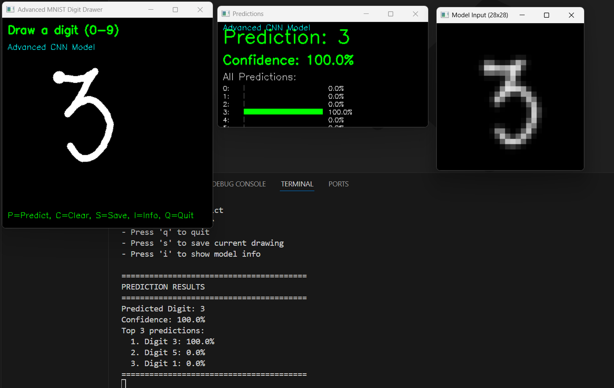
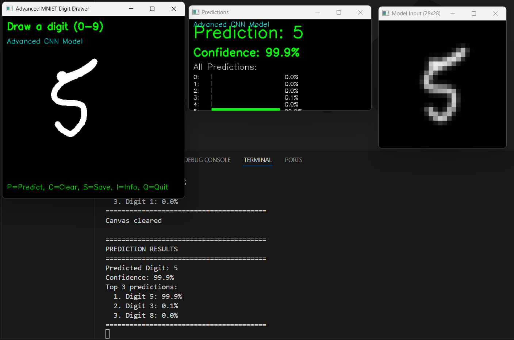

# Advanced Handwritten Digit Recognition System

This repository provides a complete solution for recognizing handwritten digits using deep learning. The system includes robust model training pipelines with advanced architectures and an interactive OpenCV-based interface for real-time digit prediction. The project is built using TensorFlow/Keras and demonstrates best practices in model design, evaluation, and deployment.

## Overview

The system consists of two core components:

1. **Model Training (`training_model.py`)**  
   Implements advanced convolutional neural networks (CNNs), residual networks, and ensemble training strategies. The training pipeline integrates data augmentation, regularization techniques, and callback mechanisms to optimize performance on the MNIST dataset.

2. **Digit Drawing and Prediction (`draw_predict.py`)**  
   A standalone OpenCV application that allows users to draw digits and receive real-time predictions. The tool mirrors the MNIST input formatting pipeline and visualizes the prediction confidence and probabilities.

## Key Features

- Advanced CNN architecture with batch normalization and dropout
- Residual network implementation inspired by ResNet
- Support for model ensembling
- Data augmentation using `ImageDataGenerator`
- Optimized training using AdamW optimizer and learning rate schedulers
- Real-time prediction interface using OpenCV
- Visual confidence metrics for predictions
- Automatic model detection from `.keras` files

## Directory Structure
```
├── training_model.py # Training script for advanced/residual/ensemble models
├── draw_predict.py # OpenCV-based digit drawing and prediction interface
├── best_advanced_model.keras # Trained model (automatically loaded by draw.py)
├── LICENSE # MIT License file
├── README.md # Project documentation
```
## Dependencies

Ensure the following packages are installed:

- Python 3.8–3.12
- TensorFlow 2.x
- OpenCV (cv2)
- NumPy
- Matplotlib
- SciPy
- scikit-learn

### Installation

Install the required Python packages:

```bash
pip install tensorflow opencv-python numpy matplotlib scipy scikit-learn
```

### Usage

#### Step 1: Model Training

To begin training, run:

```bash
python training_model.py
```

Select one of the following options:

- `1`: Train an advanced CNN model  
- `2`: Train a residual network  
- `3`: Train an ensemble of models (3 instances)

After training, the best-performing model will be saved as `best_advanced_model.keras`.

### Step 2: Real-Time Digit Prediction

Launch the drawing interface:

```bash
python draw_predict.py
```

**Controls:**

- Draw using mouse input  
- Press `p` to predict the drawn digit  
- Press `c` to clear the canvas  
- Press `s` to save the drawing and preprocessed input  
- Press `i` to view model information  
- Press `q` to exit  

---


## 📁 Screenshots

### Output 1



### Output 2



---


### Dataset

This system is trained and evaluated on the [MNIST Handwritten Digit Dataset](http://yann.lecun.com/exdb/mnist/), a benchmark dataset widely used for image classification research.

---

### Author

Developed by **Navya Singhal**  
Independent Research Project in Deep Learning and Computer Vision  
[LinkedIn Profile](https://www.linkedin.com/in/navya-singhal-aa8442313)

---

### License

This project is licensed under the terms of the [MIT License](LICENSE).
